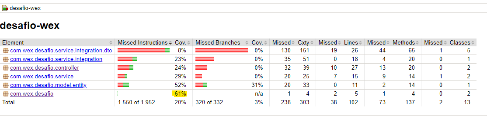
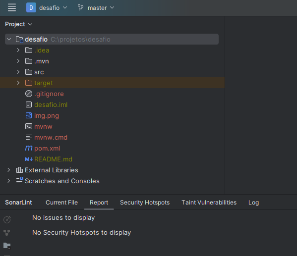

# Desafio-Wex

This is a demo Spring Boot project for the "desafio" (challenge) by Wex.

## Tech Stack

- **Spring Boot**: Version 2.7.17
- **Java**: Version 11
- **Spring Cloud**: Version 2021.0.8
- **Database**: H2
- **Code Coverage**: Jacoco

### Main Dependencies

- **spring-boot-starter-data-jpa**: For JPA functionalities.
- **spring-boot-starter-web**: For RESTful web services.
- **spring-cloud-starter-openfeign**: To create Feign REST clients.
- **spring-boot-starter-validation**: For bean validation.
- **lombok**: To reduce boilerplate code in the application.

## Getting Started

### Prerequisites

- JDK 11
- Maven

### Setup and Run

1. **Clone the Repository**:

   ```bash
   git clone [your-repository-url]
   cd desafio-wex  
    ```

2. **Run the project**:
    ```bash 
       mvn spring-boot:run
     ```

3. **Run the tests and generate the jacoco report**:  
    ```bash 
    mvn clean test
    ```
Code coverage minimum: 80%
 



**Request Examples**:

curl -X POST http://localhost:8080/api/purchase \
-H 'Content-Type: application/json' \
-d '{
"description": "testando local",
"purchaseAmount": 100,
"transactionDate": "2022-01-01"
}'


curl -X GET 'http://localhost:8080/api/purchase/1/conversion'


Sonar Lint - None Issues


